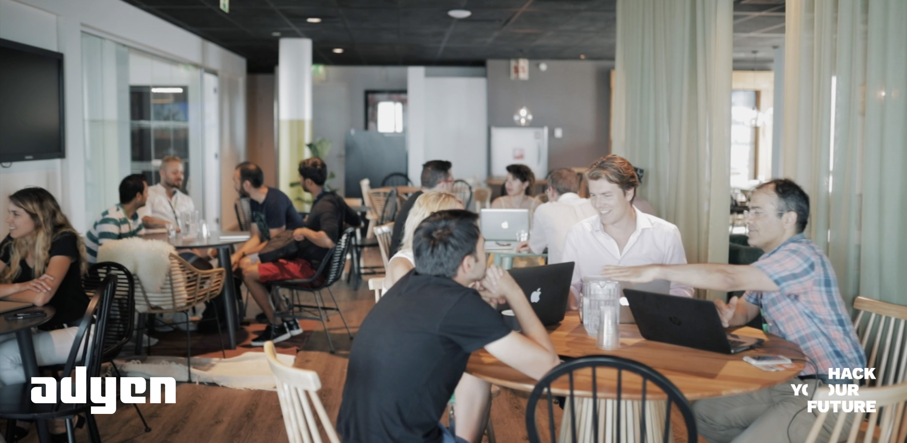
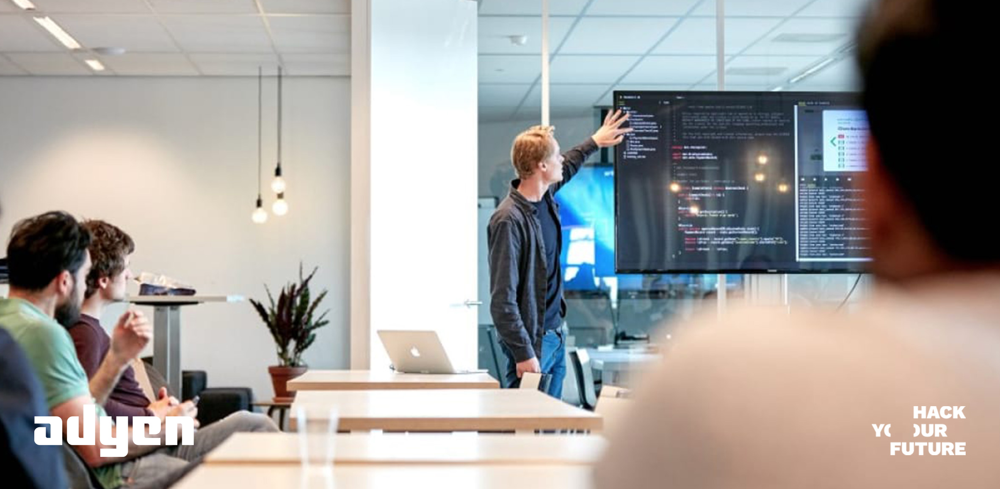

# Mockup interviews at Adyen

As with every skill, the more you do it, the better you’ll be at it. Yes, the old saying is indeed true: Practice makes perfect — particularly with job interviews. That’s why throughout your studies at HackYourFuture, you will have the opportunity to practice your interviewing skills with recruiters and engineers of one of HYF's main partners and sponsors. 

This repo is made for [students](https://github.com/HackYourFuture/interviewpreparation/blob/main/adyeninterviews.md#information-for-students) to learn how to prepare for these practices and for [Adyen employees](https://github.com/HackYourFuture/interviewpreparation/blob/main/adyeninterviews.md#information-for-interviewers) to learn best practices and receive a better understanding of what we are trying to achieve with your help.

For a promo video of our collaboration, check this [link](https://youtu.be/D1sOsEymeUs)!

## Information for Students
Please go through the information below to make the most out of your mockup interviews!

### What is a mockup interview?
A mockup interview is a simulation of a job interview used for training purposes. The exercise resembles a real interview as closely as possible to help you understand what is expected in a real job interview and helps you to improve your presentation. 

### When are the mockup interviews with Adyen and what else should I know about them?
The mockup interviews will start together with the Node module and each student will receive a total of two social and two technical interviews. These interviews will last approximately 30-40 minutes and right after the interview, you will receive both verbal and written feedback on your performance with suggestions to improve further.

### How should I prepare for the interviews?
First and foremost, you should work on your [‘personal brand’](https://github.com/HackYourFuture/yourpersonalbrand) and submit your CV as indicated [here](https://github.com/HackYourFuture/yourpersonalbrand/blob/main/yourcurriculum.md). Next, check the [Interview Preparation Repo](https://github.com/HackYourFuture/interviewpreparation) specifically made for you and your classmates. Once you are done, look at the specifics of the mockup interview job profile [here](https://careers.adyen.com/vacancies/development/510980/frontend-software-engineer) or [here](assets/samplerole.png) if the role is offline.

Last but not least, check the written feedback you’ve been given before any new interview so that you are sure you improve upon the provided feedback. The HackYourFuture team will give you access to a doc that will include all your personal feedback from each of the 4 interviews.

### What is the scope of the Social Interviews and what kind of questions can I expect?
During the Social Interview (aka [the introduction meeting](https://github.com/HackYourFuture/interviewpreparation/blob/main/introductionmeeting.md)), the interviewer will want to get to know you and your motivation, see how you communicate technical and non-technical matters, and see for themselves if you really fit into their company’s culture. This interview usually feels more like a conversation than an actual skills assessment. While there is no fixed set of questions as every interviewer has their own approach, you can still prepare for [the most common non-technical questions for HYF graduates](https://github.com/HackYourFuture/interviewpreparation/blob/main/nontechquestions.md). 

### What is the scope of the Tech Interviews and what kind of questions can I expect?
During the Tech interview (aka the [technical interview](https://github.com/HackYourFuture/interviewpreparation/blob/main/technicalinterview.md)) you will most likely be asked technical questions about the curriculum in general. To prepare for this interview, we strongly recommend you go through [the most common technical questions for HYF graduates](https://github.com/HackYourFuture/interviewpreparation/blob/main/technicalquestions.md) and have some projects or code ready to show and explain to the interviewer.

### Is there any other advice I should follow when preparing for interviews? 
Revise the content of the [HackYourFuture Values](https://github.com/HackYourFuture/values) and have some examples ready to show how they are helping you become a better developer!

### Some great advice from Viivi Reinikainen, Global recruiter at Adyen:

 > Like for every job interview, preparation is the key. Therefore, it is good to know that at Adyen we do not only hire for skills but really want to get to know you as a person to find out whether you are a fit with our company culture. 

Therefore, during this interview we would like to hear more about your ambitions, preferred way of working and why you would like to join Adyen. What does excite you about the payment industry and working in an international environment? What do you already know about Adyen? Additionally, we’d love you to read our Adyen Formula. These eight core principles guide how we work together and help ensure we keep our focus on our merchants, on changing the payments landscape, and having fun while doing it. 
 
Here are some useful links, hopefully these help you with your preparations:
- [Unobvious stories](https://www.youtube.com/playlist?list=PL6agz7H5yEoZY30Dqz8WVTd8Z9bHJZEKV)
- [Adyen Formula](https://www.youtube.com/watch?v=1jHb5lOnJw8)
- [Payments 1-0-1](https://www.youtube.com/watch?v=RyLshWxqlzs&list=PL6agz7H5yEoaeiP2cqvAOk_yJN3LF_q_X&index=1)

### When and where will the interviews be?
The HackYourFuture team will share the available timeslots for the mockup interviews in your class Slack Channel. They will also share with you a specific link to a Jitsi channel where the interview will be conducted. Once you reserve a timeslot be sure to save the date and time in your calendar and please join the interview at least a few minutes before.

### What if I cannot attend an interview that I already committed to?
Mockup interviews should be treated as real interviews! Therefore we expect that you will take them seriously and commit to them. In case of an emergency preventing you from attending, please let the HackYourFuture team know as soon as possible and ideally try to swap the appointment with another student so that we do not waste anyone’s time and assure we make the most out of this great opportunity!

## Information for Adyen Interviewers

First of all, thanks a lot for helping our students improve their interviewing skills. It is very inspiring to see how you and many of your colleagues are making time in your busy agendas to help others. In this repo we will try to cover some learned lessons from previous rounds of mockup interviews with Adyen-employees and provide some practical tips on how to conduct mockup interviews as effectively as possible.

### About HackYourFuture
At HackYourFuture we support people with a distance to the labor market find quality employment. We believe in a world where people’s drive and potential, and not their background, defines their career opportunities. HackYourFuture is built on four core values, which form the ethical framework in which we try to realize our mission. Our core values should guide us all: the core team, students, and mentors. We ask everyone involved in our community to abide by these values so that we can together be sure that no talent goes to waste. To learn more about our mission, Vision and Values, please check [this repo](https://github.com/HackYourFuture/values).

### The Sample position
Students will prepare for the Frontend Software Engineer role posted [here](https://careers.adyen.com/vacancies/development/510980/frontend-software-engineer) or [here](assets/samplerole.png) if the role is offline.

### Social Interview Scope
If you want some guidance for this interview, check [the most common non-technical questions for HYF graduates](https://github.com/HackYourFuture/interviewpreparation/blob/main/nontechquestions.md). Still, feel free to stick to your own style of interviewing. 
 
### Tech Interview Scope
[Here](https://github.com/HackYourFuture/curriculum) you can find the HackYourFuture curriculum with everything students learn throughout the 7-month course. Additionally, we created a list of [the most common technical questions for HYF graduates](https://github.com/HackYourFuture/interviewpreparation/blob/main/technicalquestions.md). You can also find the questions, including answers, in the Google Sheet shared with you by Adyen employees coordinating the mockup interviews.

### Giving Feedback and other important details
An Adyen colleague will give you access to a Google Sheet which will include the interview schedule, the interview videoconference link, a list of Social and Tech interviews (with answers), and links to the students' CVs and Feedback Sheets. The interviewers, students and the HackYourFuture organization will have access to the Feedback sheet so that together we can help students become true interview warriors! 

Please always remember to fill in this sheet during or right after the interview so the student can refer to it when preparing for the next interviews. Your feedback is crucial for progress. While we expect you to be as constructive as possible with your feedback and aware that this is most likely the first-ever interviews for our students, we also ask you to be critical and to challenge the students so that they improve as much as possible. Finding a job as a developer is not an easy task and the better we help students prepare the better their chances to succeed at it!

### What if a student is not in the call?
Feel free to contact the student directly by phone or email. His/her info is included in their CV which you can access through the mockup interview Google Sheet.

### Further information or feedback
If you have any specific questions or feedback, feel free to reach out to [Federico](https://www.linkedin.com/in/fedefusco/) from the HackYourFuture team at federico@hackyourfuture.net.

