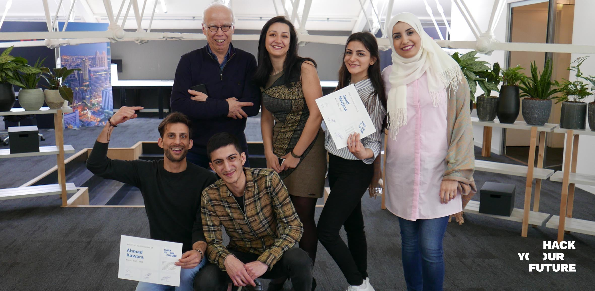

# Graduation Interviews

To graduate from HackYourFuture, you will have to pass a soft-skills graduation interview as well as a technical interview with the HYF team (these could also be combined in only one meeting). 

If you pass these interviews and the graduation project is finalised, you will officially graduate and we will start sending your CVs to companies! Expect a lot of interviews and technical assignments coming your way!

If we think that you are not ready yet, we will discuss your particular situation and come up with a tailored plan for the time to come. The plan really depends on you and what we think you need to improve, but here are some examples as reference:

Example 1: Build 1 or 2 technical assignments from real companies in a defined period of time.
Example 2: Conduct further interviews with HYF mentors until you reach a good level.
Example 3: Redo the graduation project with another cohort.
Example 4: Work in an individual technical assignment while redoing the soft-skills graduation interview.

In this repo, we will give you all the information you need so that you can prepare for both these interviews well in advance and graduate as soon as possible.

## PART 1: The soft-skills graduation interview

During a 20 minute conversation, the HYF team will interview you as if you were applying for a junior web developer role at “The HackYourFuture Company” [(See job description here)](https://github.com/HackYourFuture/interviewpreparation/blob/main/jobdescription.md). 

Think of this assessment as an actual interview for a real job with us, where the interviewer can ask you basically any questions. The goal behind this is to assess if you are ready for real interviews and if not, make a plan with you to improve these crucial skills as soon as possible.

### Some of the questions we could ask you during the interview are (not limited to):
- Can you tell us a bit about yourself?
- Why have you decided to become a web developer after working as a...?
- Why do you want to work at HackYourFuture?
- What makes YOU a good developer?
- What is important for YOU in a job? 
- What are your strengths? And your weaknesses?
- What part of web development do you think is the most difficult?
- Can you tell us about...a challenge you’ve faced at work and how you overcame it? / A time you worked on a team? / A time you solved a problem?

### To assess if you are ready to pass this exercise, we will look at the following:
- Is it a good conversation and do you make good use of language?
- Do you use storytelling and STAR stories to back up your statements with real examples?
- Do you use information from the company you are applying to (Mission, Vision, Values, News, etc), to show you’ve done your research and are motivated for the job?
- Do you have good questions ready for the interviewer?
- Is your CV 100% finished? (Following the CV guidelines, with at least 4 good projects added including the graduation one, no typos, feedback implemented, good format, etc)
- Are your Linkedin and GitHub profiles (and readme files for projects) in line with the specification from the [Personal brand repo](https://github.com/HackYourFuture/yourpersonalbrand)?

### To prepare for this interview, you should:
- Revise the [Interview Preparation repo](https://github.com/HackYourFuture/interviewpreparation) on GitHub and have your answers to the most common interview questions ready and perfected.
- Revise all the feedback you received during your interviews at Adyen (to not make the same mistakes and actually improve on them).
- Research the [job description](https://github.com/HackYourFuture/interviewpreparation/blob/main/jobdescription.md), the company (in this case HYF) and have great STAR stories, examples and questions ready for our talk.
- Be sure your CV is 100% finished.
- Practice, practice, practice!

## PART 2: The technical graduation assessment

During the project as well, as the 30-40 minute interview at the end, the HYF team will look at the level of your technical skills. The final interview will be, as in all the tech interviews in the curriculum, as close to real world tech interviews as possible.

### Interview steps
- We will ask you to explain a couple of tech concepts. This can be anything that was mentioned in the curriculum
- We will ask you to demo the final project to us as if we have never seen it
- We will ask you to demo the code to explain how the app works
- Lastly we will ask you some questions about the code. These are things like:
    - Why did you use x?
    - Shouldn’t that be written as x?
    - How did you solve x?

### To assess if you are ready to pass the technical, we will look at the following:
- How did you perform in the project
- How well did you answer the concept questions
- How well did you explain your code
- Could you understand and talk about the code easily

### To prepare for this interview, you should:
- Practice the demonstration of your project, make sure it is short and concise
- Go through the curriculum and make sure that you can explain all the concepts discussed (The 'agenda' sections of every week gives you the names of all the concepts) 
- Go through the code of the project and make sure you understand how it is built

## Results
A few days after the interview, the HYF team will let you know if you passed the assessment or not. If you did, congratulations! If you didn’t, this is just an indication that you will need to work more before we can graduate you and introduce you to companies. Think of it as an opportunity to improve your skills but now with more time given that there is no homework, and the graduation project should be almost finalised.

Our mission at HackYourFuture is to help you find (and keep) a job you like and for that we need to be very straightforward when improvements are needed. We’ve helped almost 200 people start jobs at over 60 different companies, so you can trust that our feedback is only to help you improve. 

For more information about the possible paths before/after graduation, see the [week 7 info of the graduation project](https://github.com/HackYourFuture/Project/blob/master/week7/MAKEME.md).

We look forward to having these interviews with you and moving forward through your HYF journey together!

The HackYourFuture team
