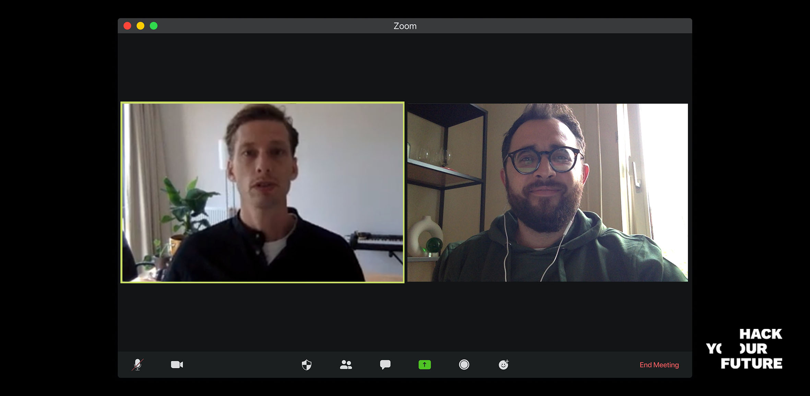

# The introduction meeting

During the introduction meeting, the company wants to get to know you and your motivations, see how you communicate technical and non-technical matters, and see for themselves if you really fit into their company’s culture. This interview usually feels more like a conversation than an actual skills test as the interviewer will try to answer a few basic questions about you just like:

- Are you a nice, likeable person?
- Would you work well inside the existing team?
- Do you seem to be passionate about technology? 
- Do you seem to be passionate about their company, products and/or services?
- Do you seem smart and can you communicate well?
- Do you have the right mindset for a junior developer?
- Up to what degree can you work independently?

While the interviewer could ask you these (or other) questions directly, they will most likely ask proxy questions to try to discover the answers for themselves.  As a Junior developer, the extent to which you are curious and excited about technology and the company you are interviewing at is a good predictor of whether you would be a good fit for the company. For a successful introduction meeting, It’s important to prepare as much as possible. To help you do just that, here the 8 most important tips:

[1. Go armed with knowledge](https://github.com/HackYourFuture/interviewpreparation/blob/main/introductionmeeting.md#1-go-armed-with-knowledge) 
[2. Be friendly, curious, and conversational](https://github.com/HackYourFuture/interviewpreparation/blob/main/introductionmeeting.md#2-be-friendly-curious-and-conversational) 
[3. Be honest...always!](https://github.com/HackYourFuture/interviewpreparation/blob/main/introductionmeeting.md#3-be-honestalways) 
[4. Prepare for the most common interview questions](https://github.com/HackYourFuture/interviewpreparation/blob/main/introductionmeeting.md#4-prepare-for-the-most-common-interview-questions) 
[5. Prepare some STAR stories](https://github.com/HackYourFuture/interviewpreparation/blob/main/introductionmeeting.md#5-prepare-star-stories) 
[6. Prepare great questions](https://github.com/HackYourFuture/interviewpreparation/blob/main/introductionmeeting.md#6-prepare-great-questions) 
[7. Practice, practice, practice!](https://github.com/HackYourFuture/interviewpreparation/blob/main/introductionmeeting.md#7-practice-practice-practice) 
[8. Send a thank-you email](https://github.com/HackYourFuture/interviewpreparation/blob/main/introductionmeeting.md#8-send-a-thank-you-email) 

With no further due, let's get started!

## 1. Go armed with knowledge

Find out as much as you can about the company and position. Go to their website and read all sections, check all of their social media including LinkedIn, YouTube and others, look for them on google (this might take you to some interesting 3rd party articles). 

Look specially for those pages that explain the company’s vision, mission and values. These usually describe the way the company works and is crucial you can prove during the interview that you are a good fit there. For some examples on that check [this example](https://www.adyen.com/about) about Adyen and [this one](https://www.ing.jobs/belgium/why-ing/our-values.htm) about ING bank. 

Also look at the job posting (if available) and check the technologies they use and everything else you can find in there. While sometimes you won’t find a job posting for the specific position you are applying to, looking at other similar positions on the company's website can give you a very good idea of the stack they use and other crucial details.

Research the industry the company is in and also for bonus points find out who their competitors are and create informed opinions about both. For instance, if applying for a job at Adyen, it would be smart of you to understand the payment’s arena and how they compare to other companies offering similar products and services. Remember that all the information you might need is just [a few search queries away](https://lmgtfy.app/?q=who+are+adyens+competitors).

If you’re still unclear about the why and how of researching a company, take a look at the [‘How to Research a Company’](https://www.youtube.com/watch?v=9PIQkTlsofI) video by 
Natalie Fisher.

## 2. Be friendly, curious, and conversational. 

The introduction meeting is your opportunity to demonstrate a passion for what you do. The one thing Junior Developers will never have an excuse for is not having any passion for the job. Explain to the interview why you need to be working in this field and show the energy you can bring to the company. While the interviewer knows you are not an expert with decades of experience, they do want to see that you are eager to learn, that you know how to voice your opinion in constructive ways and that you are flexible enough to work well in an environment where everyone else most likely knows a bit (or possibly a lot) more about the job athan you do.

We strongly recommend that you read [“What does a great software engineer look like?”](
https://medium.com/airtribe/what-does-a-great-software-engineer-look-like-27ae75eabf79) and [“The 6 Qualities that Hiring Managers Look for in Junior Devs’](https://www.startupinstitute.com/blog/2016-04-13-qualities-of-a-good-developer-karl-hughes) and prepare a few examples of how you showed some of those qualities in the past. 

## 3. Be honest...always!

Junior Developers are almost never hired based on their domain knowledge, it is taken as a given that they don't have much of that yet so don't worry about what you don't know. If you don't know about a particular subject or technology or how to answer a question, say you don’t know. It’s also good practice to indicate that you would love to learn about that in the future or that you would get back to them on that point later in time (point 8 will give you some tips for that). 

## 4. Prepare for the most common interview questions.

The Internet is flooded with great resources on how to prepare for the most common interview questions. Besides our guide with [“The Most Common Non-Technical Questions for HYF Graduates”](/nontechquestions.md) you should also read [“Top 10 Job Interview Questions and Best Answers”](https://www.thebalancecareers.com/top-interview-questions-and-best-answers-2061225) and [“10 Common Behavioral Interview Questions”](https://www.thebalancecareers.com/top-behavioral-interview-questions-2059618).

## 5. Prepare STAR stories

[The STAR interview technique](https://www.themuse.com/advice/star-interview-method) offers a straightforward format you can use to answer behavioral interview questions—those prompts that ask you to provide a real-life example of how you handled a certain kind of situation at work in the past.

In short, it is very important that during the interview you backup all of your statements with specific evidence. Give at least one, but preferably two arguments to support every answer. So, if you are asked about your strengths, provide the interviewer with at least two strengths.

Subsequently, you need to provide examples and details to back up your arguments. For instance:

***Example 1:*** ”I think I am a good developer because I constantly keep on learning new things. For instance, while studying at HYF I was not only revising the fundamentals of Javascript and React daily and working on assignments, but I was also studying English to be ready for a job as soon as possible. Also since I graduated, I’ve been redoing my most challenging HYF assignments but this time in Vue.js instead of React. I like to challenge myself and always learn new things!”

***Example 2:*** ”I think I could be a great fit for Adyen. Besides being very passionate about payments as my background in finance shows, I am a strong believer in honest and efficient collaboration. As the Adyen formula states, “Winning is more important than ego” and that is exactly the way I love to work. For instance, when developing our graduation project on HYF my team and I [give a relevant example here].”

## 6. Prepare great questions 

It's very likely that at the end of the interview the recruiter will ask if you have any questions for them. If they don’t ask you that, be sure to ask that yourself! It is more than acceptable if you ask: “Can I please ask a few further questions about the company and the job before ending the interview?” This is your chance to show how much you researched for the interview and how motivated you are for the job.

Be sure to prepare these questions in advance and that they are well informed! Asking about their tech stack when that is already mentioned on the job description or where the office is located will give the interviewer the impression you didn’t do your research and that will most likely play against you. Also, be sure to not only ask questions about the technical part of the job but also about the company’s culture, processes and maybe even about the interviewers opinion on the company. Here some good examples:

***Example 1:*** “I saw in the Adyen website that you work as a team across cultures and time zones. This is super cool! Are the teams Agile or they follow Waterfall methodology?”

***Example 2:*** “As a junior developer, I find feedback on my work quite crucial as it really helps me improve my skills. This was crucial during my time at HYF. Do you know how developers on your team give each other feedback about their code and how often?”

## 7. Practice, practice, practice!

After reading and watching all the content above, start practicing. Here some ideas on how you can do just that:

- Write down the answer to all the most common interview questions. The idea here is not that you memorise the answers, but to think on how to best answer the questions and which examples you can give to illustrate your answers.
- Even if you give the perfect answers, if your body language is weak you will have a difficult time coming across correctly. [Here](https://www.thebalancecareers.com/body-language-tips-for-your-next-job-interview-2060576) you can find some tips on how to improve your body language and [here](https://www.youtube.com/watch?v=sXAHwa1CWYw) a very helpful video on the same topic.
- Film yourself answering those questions and evaluate them after. How well did you do? Can you improve any of the answers? You can also ask a classmate or friend to practice with you.
- While the introduction meeting usually doesn’t dig deep in technical matters, it can happen that the recruiter or hiring manager asks you some technical questions to gauge your level and be sure your fundamentals are sharp. Be sure to always revise the [most common technical questions for HYF graduates](/technicalquestions.md) before any interview though if you studied them well during the course you should be ready to go!
- Know that there’s a very big chance that your interview will be done online. Interviewing via a Zoom or Google Hangout is a lot different than meeting in person, but is also something you can prepare for. To help your next video interview go as smoothly as possible, read this tips on [How to Ace an Online Job Interview](https://www.wired.com/story/tips-for-online-job-interviews/)!
- Once you are well prepared, plan a mockup interview or two with someone from the HackYourFuture team who will provide you with specific feedback on how you can improve your interviewing skills.

## 8. Send a thank-you email

[Writing a thank-you email](https://www.thebalancecareers.com/how-to-write-an-interview-thank-you-letter-2063981) immediately after an employment interview is a **must**. It's critical that you take a moment to write a simple note of appreciation to those who interviewed you as this will let the employer know that you appreciate being considered for the job. It also reiterates your interest in the position and can be used to:

- Provide additional information on your qualifications 
- Answer (or re answer) a question that you couldn't (fully) explain during the interview.
- Show that you are polite, professional and know how to communicate well.

Here an example:

<pre>Dear Mr./Ms. Last Name:

Thanks a lot for your time today during the interview. I really enjoyed speaking with you
about the web developer intern position at Adyen and learning more about the Adyen formula
and the way you all work together. I think that this is very inspiring and it makes me think
that the job is an excellent match for my skills and interests.

During the interview you asked me why I preferred to work with React instead of Angular,
and I feel now that my answer fell short. On top of what I mentioned about React being the
framework I learned at HYF, I also find React to have more flexibility in building blocks,
the documentation is more accessible for a junior developer like me and I really like the 
support of the large community that uses it. Nevertheless, I’m eager to learn so working 
with one or the other is practically the same for me.

Please feel free to contact me if I can provide you with any further information or references 
and wish you a very nice day. 

Sincerely,

Your Name</pre>

Now don’t be shy and [send the best possible thank-you email](https://www.thebalancecareers.com/thank-you-email-after-job-interview-2063958) after your interview! It will definitely help out!

 

***Ready to learn more about the technical assignment?*** Then [click here!](/technicalassignment.md)
