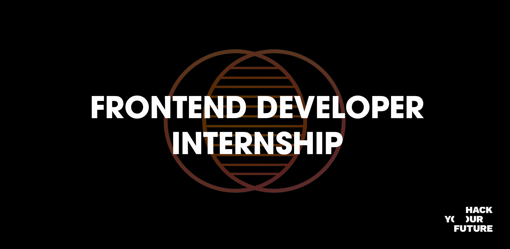

# Front-end Development Internship at HackYourFuture

For our office in Amsterdam we are looking for an ambitious trainee who wants to work on digital platforms that are used by thousands of people.

As a front-end intern you participate in the project teams as a full and indispensable member. We work with HTML5, SASS, ES6+, React, Vue and GIT. You don't have to be able to code them all fluently, but it's nice if some of these terms are not foreign to you. Of course you have to be technically in tip-top shape, but there is more to it: our front-enders must have a good sense of design and user experience. The internship will start next month, and you will work in Amsterdam. Of course we want to put you to the test, so working out a case is part of the application procedure.

As an intern we will train you to become a development professional. By learning, but above all by doing! By means of professional training courses, interactive workshops about the latest technology and intensive 1-on-1 guidance from the best developers, as well as working on the coolest projects in a team, we ensure that this is not just an internship, but a big step in your personal and professional development.

We are a young company and the best minds work every day for a wide range of partners such as Adyen, Exact and ING. We prefer to have the most talented experts on board, but we are also looking for the perfect [cultural fit](https://github.com/HackYourFuture/culture). Someone who is not afraid to learn, inspire and strive for a better world. Someone who looks ahead, dares to take the stage, and who [lives our values and dream of our Mission](https://github.com/HackYourFuture/culture).

YOU:
- Never stops talking about your passion for development;
- Not only thinks technology is very cool, but knows that the end user is always central;
- Likes to explore new frameworks;
- Have knowledge of HTML, CSS and Javascript;
- Have a basic understanding of Vuejs and Apex framework;
- Are eager to learn and always open to new developments;
- Master the English language verbally and in writing;
- Affinity with social media, design and technology.
- Have a great portfolio / GitHub that we would like to receive with your application;

WE OFFER:
- [An open culture](https://github.com/HackYourFuture/culture);
- The opportunity to develop and grow into a true professional;
- Intensive guidance and full membership to the team;
